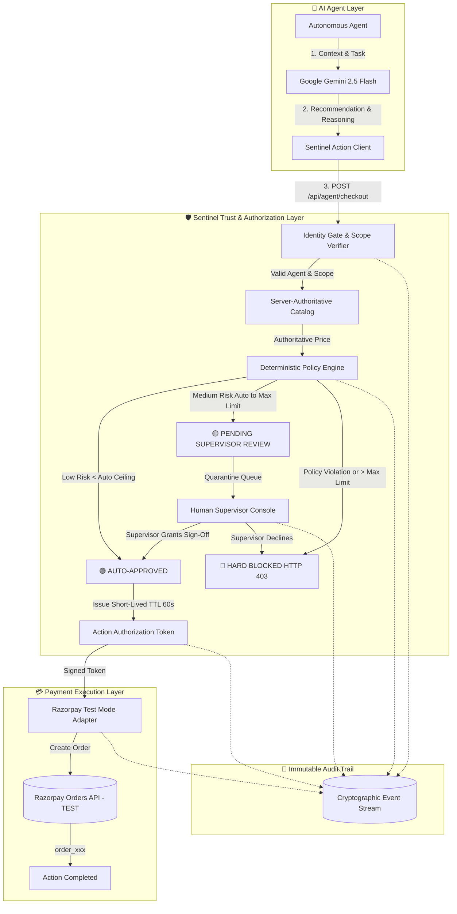

# 🛡️ Sentinel

### The Trust & Authorization Layer for AI Agents

> **AI agents can act. Sentinel defines what they are trusted to do.**

[](https://nodejs.org/)
[](https://expressjs.com/)
[](https://deepmind.google/technologies/gemini/)
[](https://razorpay.com/)
[](https://opensource.org/licenses/MIT)

---

## 💡 The Core Problem

As autonomous AI agents evolve from conversational chatbots into autonomous actors capable of browsing catalogs, executing APIs, and ordering supplies, a critical question emerges:

### **Who decides what an AI agent is actually trusted to do?**

Traditional payment and commerce APIs were built for human-in-the-loop browser sessions:
```text
Human → Browser → Shopping Cart → Checkout
```

Not autonomous LLM agents:
```text
Autonomous AI Agent → Merchant API → Financial Execution
```

Giving an autonomous AI agent direct access to payment credentials or unrestricted API tokens introduces severe risks:
* **LLM Hallucinations**: Fabricating discounts, unit prices, or inventory items.
* **Prompt Injections & Exploits**: Hijacking agent objectives to purchase unauthorized goods.
* **Spending Ceiling Violations**: Exceeding organizational budgets during autonomous loops.
* **Retry Storms & Double Billing**: Replaying transactions during transient network failures.

**Sentinel bridges this trust gap.** It sits between AI intention and real-world execution.

---

## 🛡️ The Sentinel Solution

```text
🤖 AI AGENT
     │
     │ 1. Requests action
     ▼
🛡️ SENTINEL TRUST LAYER
 ├── 1. Cryptographic Identity Verification
 ├── 2. Capability Scope Check (e.g. 'checkout.request')
 ├── 3. Server-Authoritative Price Lookup
 ├── 4. Category Restriction Evaluation
 ├── 5. Three-Tier Spending Authority Scoring
 └── 6. Human-in-the-Loop Quarantine (if Medium Risk)
     │
     │ 2. Issues 60s Short-Lived Authorization (auth_xxx)
     ▼
💳 RAZORPAY TEST MODE
     │
     │ 3. Creates Test Order (order_xxx)
     ▼
🌍 REAL-WORLD ACTION COMPLETED
```

---

## 🏗️ Architecture



---

## 🧠 Key Architectural Principle: Intelligence ≠ Authority

A foundational design tenet of Sentinel:

> **AI recommends what it wants to do. Sentinel defines what it is trusted to do.**

* **Google Gemini AI** analyzes domain context, product catalogs, and mission goals to suggest the most appropriate item.
* **Sentinel Policy Engine** independently validates agent identity, overrides client-submitted prices with server-authoritative catalog data, enforces spending boundaries, blocks restricted categories, and gates execution.

The AI model **never** has the authority to:
- Override item prices or discounts.
- Increase its own spending authority.
- Bypass category restrictions.
- Self-approve medium-risk purchases.

---

## 🚦 Three-Tier Authority System

Sentinel enforces deterministic authority tiers configured per agent:

| Authority Level | Risk Profile | Evaluation Criteria | Sentinel Decision | Razorpay Execution |
| :--- | :--- | :--- | :--- | :--- |
| **🟢 LOW AUTHORITY** | Routine, low-cost essentials | Price < `autoApproveBelow` & Allowed Category | **Auto-Approved** (60s TTL Token Issued) | ✅ Test Order Created |
| **🟡 MEDIUM AUTHORITY** | High-value, critical supplies | `autoApproveBelow` ≤ Price ≤ `maxTransactionAmount` | **Quarantined for Supervisor Review** | ⏳ Zero orders until human sign-off |
| **🔴 HIGH / RESTRICTED** | Policy breach or luxury items | Price > `maxTransactionAmount` OR Blocked Category | **Hard Blocked (HTTP 403)** | 🛑 Zero tokens, zero payment calls |

### Real Configured Agents in Registry (`server.js`):
1. **🌍 Relief Supply Agent (`relief_agent_001`)**: Max Authority: ₹100,000 | Auto-Approve Below: ₹10,000 | Allowed: `water`, `food`, `medicine`, `shelter` | Blocked: `luxury`, `electronics`, `restricted`
2. **🏢 Operations Procurement Agent (`procurement_agent_001`)**: Max Authority: ₹50,000 | Auto-Approve Below: ₹5,000 | Allowed: `office`, `technology`, `operations` | Blocked: `personal`, `luxury`, `entertainment`
3. **🤖 Aarohi Shopping Agent (`agent_demo_001`)**: Max Authority: ₹1,500 | Auto-Approve Below: ₹1,000 | Allowed: `apparel`, `accessories`, `home` | Blocked: `electronics`, `luxury`, `restricted`

---

## 🔐 Defensive Security Model

* **Server-Authoritative Product Prices**: Client-supplied prices in request bodies are ignored. Prices are resolved from server storage.
* **Short-Lived Ephemeral Authorization**: Action tokens expire in 60 seconds (TTL) and are invalidated upon use.
* **Deterministic Idempotency**: `Idempotency-Key` headers prevent duplicate charges during AI retry loops.
* **Masked Token Previews**: Secrets are never sent to frontend clients (`tok_sec_xxx...` previews only).
* **Deterministic AI Fallback**: If Google Gemini is unavailable, Sentinel falls back cleanly to a deterministic recommendation while preserving 100% of policy checks.

---

## 💳 Razorpay Payment Integration

> [!NOTE]
> **Razorpay integration runs strictly in `TEST_MODE`** for this prototype.  
> Creating a Razorpay Test Mode order (`order_xxx`) creates an authorized test transaction in the Razorpay sandbox environment and **does not charge real currency**.

Flow:
```text
AI Agent → Sentinel Policy Gate → Signed Auth Token → Razorpay Test Mode Adapter → Test Order Created
```

---

## 🚀 Quick Start

### 1. Clone the Repository
```bash
git clone https://github.com/Sumitsutharss/Sentinal.git
cd Sentinal
```

### 2. Install Dependencies
```bash
npm install
```

### 3. Configure Environment Variables
```bash
cp .env.example .env
```
Edit `.env` with your API keys:
```env
GEMINI_API_KEY=your_gemini_api_key_here
GEMINI_MODEL=gemini-2.5-flash

# Optional Razorpay Test Mode Credentials
RAZORPAY_KEY_ID=your_razorpay_test_key_id
RAZORPAY_KEY_SECRET=your_razorpay_test_key_secret

PORT=3000
AGENT_BASE_URL=http://localhost:3000
```

### 4. Start Sentinel Server
```bash
node server.js
```
*Open Control Center in browser:* **`http://localhost:3000`**

### 5. Run Autonomous AI Buyer Simulation
```bash
node buyer.js 1500
```

### 6. Run Automated QA Suite
```bash
node test_qa.js
```

---

## 🎭 Live Demo Scenarios

| Scenario | Trigger | What Happens |
| :--- | :--- | :--- |
| **🟢 1. Auto-Approved Action** | Emergency Water (₹8,000) | Price < ₹10k auto-approval limit. Sentinel issues 60s authorization token and triggers a Razorpay Test Mode order (`order_xxx`). |
| **🟡 2. Human Supervisor Review** | Medical Trauma Kits (₹45,000) | Price is between ₹10k and ₹100k. Transaction enters supervisor quarantine queue. Zero tokens or orders generated until human clicks **✓ Approve**. |
| **🔴 3. Category Restriction Block** | Luxury Smartphone (₹20,000) | Even though ₹20k is within ₹100k budget, category `electronics` is restricted. Returns `HTTP 403 Forbidden`. Zero payment calls. |
| **🔁 4. Idempotency Protection** | Replay identical request | Request with matching `Idempotency-Key` returns cached order without duplicating financial execution. |

---

## 📡 API Reference

| Method | Endpoint | Description |
| :--- | :--- | :--- |
| `GET` | `/health` | System health, active agents count, Gemini AI & Razorpay adapter status |
| `GET` | `/api/agents` | List active agent identities, capability scopes, and policy thresholds |
| `GET` | `/api/agent/catalog` | Discover server-authoritative product catalog for a specific agent |
| `POST` | `/api/ai/recommend` | Consult Gemini 2.5 Flash for autonomous product recommendation & rationale |
| `POST` | `/api/policy/simulate` | Inspect deterministic policy check breakdown before execution |
| `POST` | `/api/agent/checkout` | Universal policy gate — issues short-lived token & Razorpay test order |
| `POST` | `/api/demo/run` | Execute controlled real-world demo scenarios (water, meds, phone) |
| `GET` | `/api/approvals` | List pending and resolved human supervisor approval requests |
| `POST` | `/api/approvals/:id/approve` | Human supervisor signs off quarantined action & triggers payment |
| `POST` | `/api/approvals/:id/reject` | Human supervisor declines quarantined action |
| `GET` | `/api/activity` | Stream real-time agent telemetry and policy decision events |
| `GET` | `/api/agent/audit` | Fetch complete audit trail with SHA-256 integrity checksums |
| `POST` | `/api/agent/reset` | Reset demo state, queues, and activity logs |

---

## 📁 Repository Structure

```text
sentinel/
├── .github/
│   └── workflows/
│       └── qa.yml              # Automated GitHub Actions CI workflow
├── docs/
│   ├── architecture.md         # System design, lifecycle & Mermaid diagrams
│   ├── security.md             # Threat matrix & defensive validation architecture
│   ├── demo.md                 # Step-by-step hackathon judge demo guide
│   └── screenshots/            # UI walkthrough captures
├── public/
│   ├── index.html              # Sentinel Control Center & 3D Globe Landing UI
│   ├── style.css               # Clean luxury infrastructure design system
│   └── app.js                  # Frontend state management & live event stream
├── .env.example                # Safe environment variable template
├── .gitignore                  # Git ignore rules (.env protected)
├── LICENSE                     # MIT License
├── README.md                   # Project overview & documentation
├── buyer.js                    # Autonomous Gemini buyer agent simulation script
├── package.json                # Project dependencies & scripts
├── server.js                   # Sentinel Express server & Policy Engine
└── test_qa.js                  # 22-point end-to-end automated QA test suite
```

---

## 🌍 The Future of Autonomous Actions

The future will not only have humans interacting with financial systems and digital services.

AI agents will increasingly act on behalf of people and organizations — managing supply chains, procuring emergency disaster relief, and booking services autonomously.

The question is not simply:
> *"What can an AI agent do?"*

The question is:
> **"What should an AI agent be trusted to do?"**

🛡️ **Sentinel provides the boundary.**

---

*Built for the Razorpay AI Builder Hackathon 2026.*
