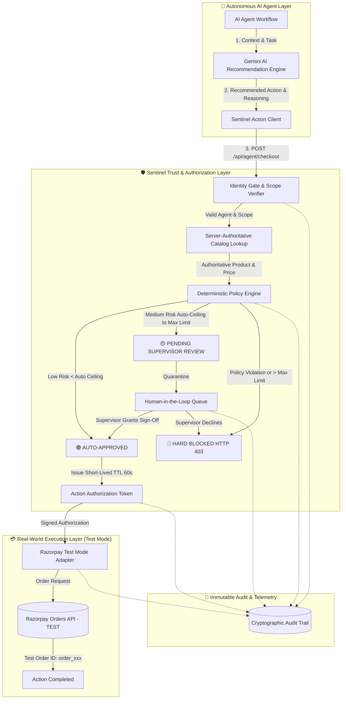

# 🏗️ Sentinel Architecture & System Design

> **The Trust & Authorization Layer for AI Agents**  
> *"AI agents can act. Sentinel defines what they are trusted to do."*

---

## 1. System Overview

Sentinel is a policy-governed authorization infrastructure positioned between autonomous AI agents (powered by Large Language Models such as Google Gemini) and sensitive real-world execution systems (such as Payment Gateways and Procurement APIs).



---

## 2. Core Architectural Principle: Intelligence ≠ Authority

A fundamental security tenet of Sentinel is that **AI intelligence must never be confused with execution authority**.

```text
┌────────────────────────────────────────────────────────┐
│                   🤖 Google Gemini AI                   │
│  "Recommends what product fits the mission context"    │
└───────────────────────────┬────────────────────────────┘
                            │
                            ▼
┌────────────────────────────────────────────────────────┐
│              🛡️ Sentinel Policy Engine                 │
│  • Enforces spending ceilings server-side              │
│  • Overrides AI-hallucinated or tampered prices        │
│  • Blocks unauthorized product categories              │
│  • Mandates human supervisor oversight                 │
│  • Issues short-lived cryptographic authorization      │
└───────────────────────────┬────────────────────────────┘
                            │
                            ▼
┌────────────────────────────────────────────────────────┐
│              💳 Razorpay (TEST_MODE)                   │
│  • Executes financial orders ONLY with signed token    │
└────────────────────────────────────────────────────────┘
```

---

## 3. End-to-End Request Lifecycle

### Phase 1: AI Recommendation
1. The autonomous agent (e.g., `buyer.js` or external agent) invokes `POST /api/ai/recommend`.
2. Google Gemini evaluates available products against the agent's domain context and returns a recommendation with confidence score and structured rationale.
3. If Gemini is unavailable, Sentinel falls back cleanly to a deterministic recommendation without bypassing any downstream security gates.

### Phase 2: Action Submission to Sentinel Gate
1. The agent submits `POST /api/agent/checkout` with `agentId`, `productId`, `Idempotency-Key`, and capability scopes.
2. **Identity Verification**: Checks if `agentId` is registered and in `ACTIVE` status.
3. **Capability Scopes**: Confirms the agent has `checkout.request` (or `relief.procurement`, `procurement.request`).
4. **Authoritative Price Lookup**: Sentinel ignores any price sent by the client and reads the server's authoritative price from the master catalog.
5. **Category Boundary Check**: Ensures the product's category is in the agent's `allowedCategories` and NOT in `blockedCategories`.

### Phase 3: Authority Tier Evaluation
* **🟢 LOW AUTHORITY Tier**: If authoritative price < `autoApproveBelow`, Sentinel automatically grants approval, generates a 60-second action authorization token (`auth_xxx`, `tok_sec_xxx`), and executes the Razorpay Test Mode order.
* **🟡 MEDIUM AUTHORITY Tier**: If `autoApproveBelow` ≤ price ≤ `maxTransactionAmount`, transaction is quarantined in the supervisor queue. No payment token or order is generated until a human supervisor calls `POST /api/approvals/:id/approve`.
* **🔴 HIGH / RESTRICTED Tier**: If price > `maxTransactionAmount` or category is blocked, Sentinel immediately issues `HTTP 403 Forbidden`. Zero tokens and zero payment calls are made.

### Phase 4: Payment Adapter Execution (Razorpay Test Mode)
1. The payment adapter is invoked **only** with a valid, non-expired Sentinel authorization token.
2. An order is created on the Razorpay Test API: `razorpay.orders.create({ amount, currency: "INR", receipt, notes })`.
3. The resulting `order_xxx` is recorded in Sentinel's immutable audit log and live activity stream.

---

## 4. Multi-Agent Domain Registry

Sentinel governs multiple agent identities with isolated policies:

| Agent Name | Agent ID | Max Authority | Auto-Approve Below | Allowed Categories | Blocked Categories |
| :--- | :--- | :--- | :--- | :--- | :--- |
| **Relief Supply Agent** | `relief_agent_001` | ₹100,000 | ₹10,000 | water, food, medicine, shelter | luxury, electronics, restricted |
| **Operations Procurement Agent** | `procurement_agent_001` | ₹50,000 | ₹5,000 | office, technology, operations | personal, luxury, entertainment |
| **Aarohi Shopping Agent** | `agent_demo_001` | ₹1,500 | ₹1,000 | apparel, accessories, home | electronics, luxury, restricted |

---

## 5. Telemetry & Audit Integrity

Every state change produces an immutable event record:
- `AGENT_ACTION_REQUESTED`
- `POLICY_CHECK_PASSED` / `POLICY_CHECK_FAILED`
- `AUTHORIZATION_TOKEN_ISSUED`
- `HUMAN_APPROVAL_REQUESTED`
- `HUMAN_APPROVAL_GRANTED` / `HUMAN_APPROVAL_REJECTED`
- `RAZORPAY_TEST_ORDER_CREATED`
- `ACTION_BLOCKED`

All events include timestamps, agent identity metadata, decision outcomes, and SHA-256 integrity checksums.
